# LepiNet Complete Data Flow & System Architecture

## 📋 Table of Contents
1. [System Overview](#system-overview)
2. [Complete Image Identification Flow](#complete-image-identification-flow)
3. [Data Exchange Mechanisms](#data-exchange-mechanisms)
4. [Storage & Database Flow](#storage--database-flow)
5. [Expert Review Pipeline](#expert-review-pipeline)
6. [Mobile App Integration](#mobile-app-integration)
7. [Model Training Feedback Loop](#model-training-feedback-loop)

---

## System Overview

### High-Level Architecture

```
┌─────────────────────────────────────────────────────────────────────┐
│                          LepiNet Ecosystem                          │
├─────────────────┬───────────────┬──────────────┬────────────────────┤
│   Mobile App    │   Web Portal  │  Supabase DB │  HuggingFace API  │
│   (Flutter)     │   (Next.js)   │  (PostgreSQL)│  (AI Model)       │
└─────────────────┴───────────────┴──────────────┴────────────────────┘
```

---

## Complete Image Identification Flow

### Detailed Step-by-Step Process


### Textual Breakdown

#### **Phase 1: Image Capture & Upload** 🖼️
1. **User takes photo** in mobile app
2. **App compresses image** to reduce file size (e.g., 1024x1024 max)
3. **Upload to Supabase Storage** bucket named `butterfly-images`
4. **Get public URL**: `https://project.supabase.co/storage/v1/object/public/butterfly-images/uuid.jpg`

#### **Phase 2: Database Logging** 💾
5. **Create ai_logs entry**:
   ```sql
   INSERT INTO ai_logs (user_id, image_url, created_at) 
   VALUES ('user-uuid', 'image-url', NOW());
   ```
6. **Return log_id** to mobile app for tracking

#### **Phase 3: AI Identification** 🤖
7. **Mobile app sends request** to HuggingFace Inference API:
   ```json
   POST https://api-inference.huggingface.co/models/Bhanura/lepinet-model
   {
     "image_url": "https://...butterfly.jpg"
   }
   ```
8. **HuggingFace fetches image** from Supabase Storage URL
9. **Image preprocessed** (resized, normalized)
10. **Pass through CNN model** (e.g., ViT, ResNet, EfficientNet)
11. **Model outputs**:
    - Class index (0-244 for 245 species)
    - Confidence scores for each class

#### **Phase 4: Species Lookup** 🦋
12. **Load CSV file** `sri_lanka_butterflies_245.csv` in HuggingFace inference code
13. **Map class index to butterfly_id**:
    ```python
    # Example CSV structure:
    # class_index, butterfly_id, common_name_english, species_name_binomial, family
    # 0, 001, Common Mormon, Papilio polytes, Papilionidae
    # 1, 002, Common Jezebel, Delias eucharis, Pieridae
    
    df = pd.read_csv('sri_lanka_butterflies_245.csv')
    predicted_row = df.iloc[predicted_class_index]
    
    result = {
        "predicted_id": predicted_row['butterfly_id'],
        "predicted_name": predicted_row['common_name_english'],
        "scientific_name": predicted_row['species_name_binomial'],
        "family": predicted_row['family'],
        "confidence": confidence_scores[predicted_class_index]
    }
    ```
14. **Return species details** to mobile app

#### **Phase 5: Result Display & User Action** 📱
15. **Mobile app receives JSON**:
    ```json
    {
      "predicted_id": "001",
      "predicted_name": "Common Mormon",
      "scientific_name": "Papilio polytes",
      "family": "Papilionidae",
      "confidence": 0.9234,
      "common_name_sinhalese": "සාමාන්‍ය මෝමන්"
    }
    ```
16. **Update database** with prediction results:
    ```sql
    UPDATE ai_logs 
    SET predicted_id = '001',
        predicted_confidence = 0.9234,
        predicted_species_name = 'Common Mormon'
    WHERE id = 'log-uuid';
    ```
17. **Display to user** with species details, images from database
18. **User confirms or corrects** identification
19. **Store user action**:
    ```sql
    UPDATE ai_logs 
    SET user_action = 'ACCEPTED',  -- or 'REJECTED'
        final_species_name = 'Common Mormon'  -- user's final decision
    WHERE id = 'log-uuid';
    ```

---

## Data Exchange Mechanisms

### Component Communication Matrix

| Source | Destination | Data Format | Protocol | Purpose |
|--------|-------------|-------------|----------|---------|
| Mobile App | Supabase Storage | Binary (JPEG/PNG) | HTTP POST | Upload butterfly photo |
| Supabase Storage | Mobile App | URL (String) | HTTP 200 | Return image public URL |
| Mobile App | Supabase DB | JSON | PostgreSQL Protocol | Create/update ai_logs |
| Mobile App | HuggingFace API | JSON {image_url} | HTTPS POST | Request identification |
| HuggingFace | Supabase Storage | HTTP GET | HTTPS | Fetch image for processing |
| AI Model | HuggingFace API | NumPy Array | Internal | Class predictions + confidences |
| CSV File | HuggingFace API | Pandas DataFrame | File I/O | Species metadata lookup |
| HuggingFace API | Mobile App | JSON | HTTPS 200 | Return identification result |
| Web Portal | Supabase DB | JSON | Supabase JS Client | Query records, reviews |
| Expert | Web Portal | Form Data | HTTP POST | Submit expert review |
| Web Portal | Supabase DB | JSON | Supabase JS Client | Store expert review |

---

## Storage & Database Flow

### Supabase Storage Structure

```
butterfly-images/
├── user_uploads/
│   ├── 2024/
│   │   ├── 12/
│   │   │   ├── 21/
│   │   │   │   ├── uuid-1234.jpg
│   │   │   │   ├── uuid-5678.jpg
│   │   │   │   └── ...
│   └── staging/
│       └── temp-uploads/
└── profile_photos/
    ├── user-uuid-1.jpg
    └── user-uuid-2.jpg
```

### Database Write Flow


### Database Read Flow (Web Portal)


---

## Expert Review Pipeline

### Complete Review Workflow

```mermaid
sequenceDiagram
    participant Expert as 🎓 Expert User
    participant Web as Web Portal
    participant DB as Database
    participant Owner as 📱 Record Owner
    
    Expert->>Web: 1. Browse /records
    Web->>DB: 2. SELECT * FROM ai_logs WHERE...
    DB-->>Web: 3. Returns unreviewed records
    Web->>Expert: 4. Display records list
    
    Expert->>Web: 5. Click "Review" button
    Web->>DB: 6. Load ai_log + species details
    DB-->>Web: 7. Returns full record data
    Web->>Expert: 8. Show review form
    
    Expert->>Web: 9. Submit review (agree/correct/unsure)
    Web->>DB: 10. INSERT into expert_reviews
    Note right of DB: Stores: ai_log_id, reviewer_id,<br/>agreed_with_ai, identified_species_name,<br/>confidence_level, is_new_discovery,<br/>comments, training_status
    
    DB-->>Web: 11. Review saved successfully
    
    Web->>DB: 12. Create notification
    Note right of DB: INSERT INTO notifications<br/>(user_id=record_owner,<br/>type='review_comment',<br/>message='Expert reviewed your record')
    
    Web->>Expert: 13. Redirect to /records/[id]
    
    DB-->>Owner: 14. Push notification (if enabled)
    Owner->>Web: 15. Open notification
    Web->>DB: 16. Load record + reviews
    DB-->>Web: 17. Show all reviews
    Web->>Owner: 18. Display expert opinion
```



### Review Data Structure

```typescript
// expert_reviews table entry
{
  id: "review-uuid",
  ai_log_id: "log-uuid",              // Links to original record
  reviewer_id: "expert-user-uuid",     // Who reviewed it
  agreed_with_ai: false,               // true if agreed, false if corrected
  identified_species_name: "Blue Tiger", // Expert's identification
  confidence_level: "certain",         // "certain" or "uncertain"
  is_new_discovery: false,             // Potential new species?
  comments: "Wing pattern shows distinctive...",
  training_status: "ready",            // "pending", "ready", "trained", "ignored"
  created_at: "2024-12-21T10:30:00Z"
}
```

---

## Mobile App Integration

### Complete Mobile App Flow

```
User Opens App
      │
      ├──> Authentication (Supabase Auth)
      │    └──> Store session token
      │
      ├──> Main Dashboard
      │    ├──> My Records (query ai_logs WHERE user_id = current_user)
      │    ├──> Recent Observations (query ai_logs ORDER BY created_at)
      │    └──> My Profile
      │
      ├──> Camera Screen
      │    ├──> Take Photo
      │    ├──> Compress Image
      │    ├──> Upload to Supabase Storage
      │    │    └──> GET: public_url
      │    ├──> Create ai_logs entry
      │    ├──> Call HuggingFace API
      │    │    └──> POST: {image_url, model_version}
      │    ├──> Receive Prediction
      │    │    └──> GET: {predicted_id, confidence, species_data}
      │    ├──> Update ai_logs with prediction
      │    └──> Show Result Screen
      │         ├──> Display species info
      │         ├──> Show confidence
      │         └──> User accepts/rejects
      │              └──> UPDATE ai_logs.user_action
      │
      └──> Record Detail Screen
           ├──> Load ai_log by id
           ├──> Fetch species details from species table
           ├──> Load expert_reviews for this record
           ├──> Display comments from experts
           └──> Option to request expert review
```

### API Endpoints Mobile App Uses

| Endpoint | Method | Purpose | Request | Response |
|----------|--------|---------|---------|----------|
| Supabase Storage Upload | POST | Upload image | Binary image | `{url: "https://..."}` |
| HuggingFace Inference | POST | Get AI prediction | `{image_url}` | `{predicted_id, confidence, name}` |
| Supabase `ai_logs` | INSERT | Log new record | `{user_id, image_url}` | `{id, created_at}` |
| Supabase `ai_logs` | UPDATE | Update prediction | `{predicted_id, confidence}` | Success |
| Supabase `ai_logs` | SELECT | Get user's records | `WHERE user_id=?` | Array of records |
| Supabase `species` | SELECT | Get species info | `WHERE butterfly_id=?` | Species details |
| Supabase `expert_reviews` | SELECT | Get reviews | `WHERE ai_log_id=?` | Array of reviews |

---

## Model Training Feedback Loop

### How Expert Reviews Improve the Model


### Training Data Preparation

```python
# Example: Prepare training data from expert reviews

def prepare_training_data():
    """
    Query Supabase for expert-verified records ready for training
    """
    supabase = create_client(url, key)
    
    # Get all reviews marked as ready for training
    reviews = supabase.table("expert_reviews")\
        .select("*, ai_log:ai_logs(image_url, predicted_id)")\
        .eq("training_status", "ready")\
        .eq("confidence_level", "certain")\
        .execute()
    
    training_data = []
    
    for review in reviews.data:
        # Get the correct species (expert's identification)
        correct_species = review['identified_species_name']
        image_url = review['ai_log']['image_url']
        
        # Map species name back to butterfly_id
        species_data = supabase.table("species")\
            .select("butterfly_id")\
            .eq("common_name_english", correct_species)\
            .single()\
            .execute()
        
        if species_data.data:
            training_data.append({
                "image_url": image_url,
                "label": species_data.data['butterfly_id'],
                "review_id": review['id']
            })
    
    return training_data

# Usage in trainer.py
training_data = prepare_training_data()
print(f"Prepared {len(training_data)} images for training")

# Download images and create dataset
for item in training_data:
    download_image(item['image_url'], f"train/{item['label']}/")

# Train model with new data
train_model(dataset_path="train/")

# Mark reviews as trained
for item in training_data:
    supabase.table("expert_reviews")\
        .update({"training_status": "trained"})\
        .eq("id", item['review_id'])\
        .execute()
```

---

## Admin Training Dashboard

### Purpose
Allow admins to manage which expert reviews should be used for model training.

### Flow Diagram


### Admin Interface (Suggested)

Create this page: `app/admin/training/page.tsx`

```tsx
'use client';
import { useState, useEffect } from 'react';
import { createBrowserClient } from '@supabase/ssr';

export default function TrainingDataManager() {
  const [reviews, setReviews] = useState([]);
  const [filter, setFilter] = useState('pending');
  
  const supabase = createBrowserClient(
    process.env.NEXT_PUBLIC_SUPABASE_URL!,
    process.env.NEXT_PUBLIC_SUPABASE_ANON_KEY!
  );

  useEffect(() => {
    loadReviews();
  }, [filter]);

  const loadReviews = async () => {
    const { data } = await supabase
      .from('expert_reviews')
      .select(`
        *,
        ai_log:ai_logs(id, image_url, predicted_species_name),
        reviewer:users!reviewer_id(first_name, last_name)
      `)
      .eq('training_status', filter)
      .eq('confidence_level', 'certain')
      .order('created_at', { ascending: false });
    
    setReviews(data || []);
  };

  const updateStatus = async (reviewId: string, newStatus: string) => {
    await supabase
      .from('expert_reviews')
      .update({ training_status: newStatus })
      .eq('id', reviewId);
    
    loadReviews();
  };

  return (
    <div className="p-8">
      <h1 className="text-3xl font-bold mb-6">Training Data Management</h1>
      
      {/* Filter Tabs */}
      <div className="flex gap-2 mb-6">
        {['pending', 'ready', 'trained', 'ignored'].map(status => (
          <button
            key={status}
            onClick={() => setFilter(status)}
            className={`px-4 py-2 rounded-lg ${
              filter === status 
                ? 'bg-blue-600 text-white' 
                : 'bg-gray-200 text-gray-700'
            }`}
          >
            {status.toUpperCase()}
          </button>
        ))}
      </div>

      {/* Reviews Grid */}
      <div className="grid grid-cols-1 md:grid-cols-2 lg:grid-cols-3 gap-6">
        {reviews.map(review => (
          <div key={review.id} className="bg-white rounded-lg shadow-md p-4">
            
            <div className="space-y-2">
              <p className="font-bold text-lg">{review.identified_species_name}</p>
              <p className="text-sm text-gray-600">
                Reviewer: {review.reviewer.first_name} {review.reviewer.last_name}
              </p>
              <p className="text-sm text-gray-600">
                Confidence: <span className="font-semibold">{review.confidence_level}</span>
              </p>
              <p className="text-sm text-gray-500">
                AI Predicted: {review.ai_log.predicted_species_name}
              </p>
              <p className="text-sm text-gray-500">
                Agreed: {review.agreed_with_ai ? '✅ Yes' : '❌ No'}
              </p>
            </div>

            {/* Action Buttons */}
            <div className="mt-4 flex gap-2">
              {filter === 'pending' && (
                <>
                  <button
                    onClick={() => updateStatus(review.id, 'ready')}
                    className="flex-1 bg-green-600 text-white py-2 rounded hover:bg-green-700"
                  >
                    ✓ Ready
                  </button>
                  <button
                    onClick={() => updateStatus(review.id, 'ignored')}
                    className="flex-1 bg-gray-600 text-white py-2 rounded hover:bg-gray-700"
                  >
                    ✗ Ignore
                  </button>
                </>
              )}
              {filter === 'ready' && (
                <button
                  onClick={() => updateStatus(review.id, 'pending')}
                  className="flex-1 bg-yellow-600 text-white py-2 rounded hover:bg-yellow-700"
                >
                  ← Back to Pending
                </button>
              )}
            </div>
          </div>
        ))}
      </div>

      {reviews.length === 0 && (
        <p className="text-center text-gray-500 mt-10">
          No reviews with status: {filter}
        </p>
      )}
    </div>
  );
}
```

---

## Summary: Complete Data Journey

### 📱 **Mobile App → Storage**
- User takes photo → Flutter app uploads to Supabase Storage → Returns URL

### 💾 **Storage → Database**
- Image URL stored in `ai_logs` table → Linked to user_id

### 🤖 **Database → HuggingFace**
- Mobile app sends image URL to HuggingFace Inference API

### 🧠 **HuggingFace → Model**
- API fetches image from URL → Preprocesses → Passes through CNN

### 📊 **Model → CSV**
- Model outputs class index → Mapped to butterfly_id using `sri_lanka_butterflies_245.csv`

### 📱 **CSV → Mobile App**
- Species details (name, family, etc.) sent back as JSON

### 💾 **Mobile App → Database**
- Prediction results saved to `ai_logs` (predicted_id, confidence)

### 🌐 **Database → Web Portal**
- Web users view all records → Experts can review

### 👨‍🏫 **Web Portal → Database**
- Expert submits review → Stored in `expert_reviews` table

### 🔄 **Database → Training Pipeline**
- Admin marks reviews as "ready" → Used to retrain model → New version deployed

### ♻️ **Feedback Loop Complete**
- Improved model serves better predictions to future mobile app users

---

## Quick Reference

| Component | Role | Technology | Data Format |
|-----------|------|------------|-------------|
| Mobile App | User interface | Flutter/Dart | JSON, Binary |
| Supabase Storage | Image hosting | Object Storage | JPEG/PNG |
| Supabase Database | Data persistence | PostgreSQL | SQL/JSON |
| HuggingFace API | AI Inference | Python/FastAPI | HTTP JSON |
| AI Model | Butterfly identification | PyTorch/TensorFlow | Tensors |
| Species CSV | Reference data | CSV File | Pandas DataFrame |
| Web Portal | Expert review interface | Next.js/React | HTML/JSON |

---

**For model version management**, see [MODEL_VERSION_MANAGEMENT.md](./MODEL_VERSION_MANAGEMENT.md)

**For detailed database schema**, see [DATA_FLOW_DOCUMENTATION.md](./DATA_FLOW_DOCUMENTATION.md)
