# LepiNet Data Flow Documentation

## Overview
LepiNet is a butterfly identification and data collection platform that uses AI to help users identify butterflies and allows experts to review and verify submissions.

---

## 1. Entity Relationship Diagram

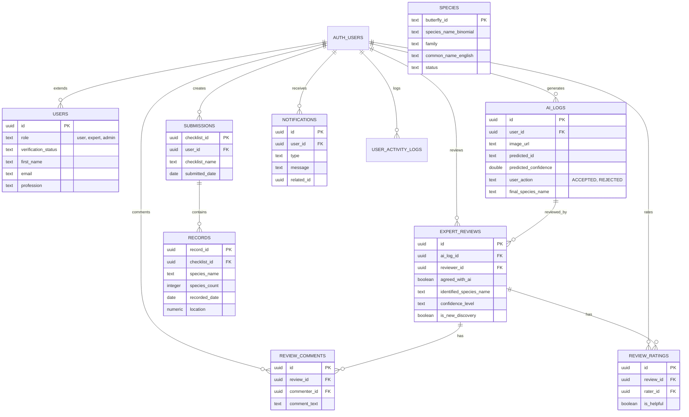

---

## 2. Core Data Flows

### 2.1 User Registration & Verification Flow

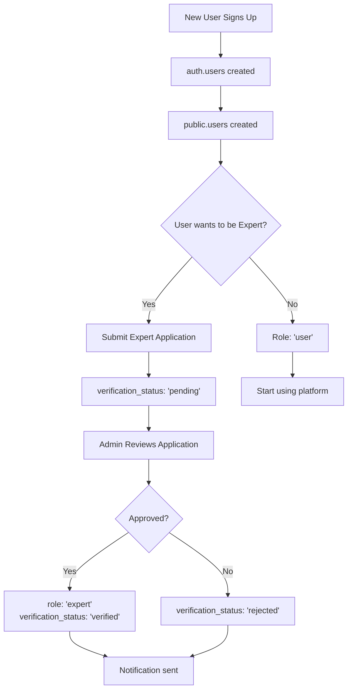

### 2.2 AI Identification Flow

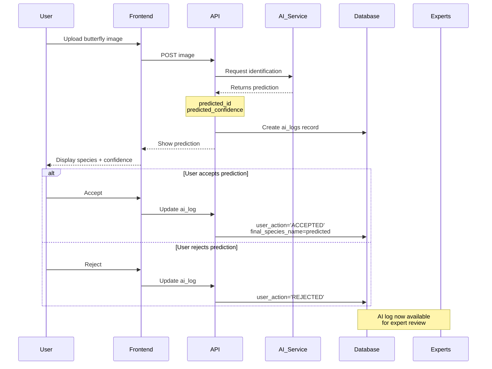

### 2.3 Manual Record Submission Flow

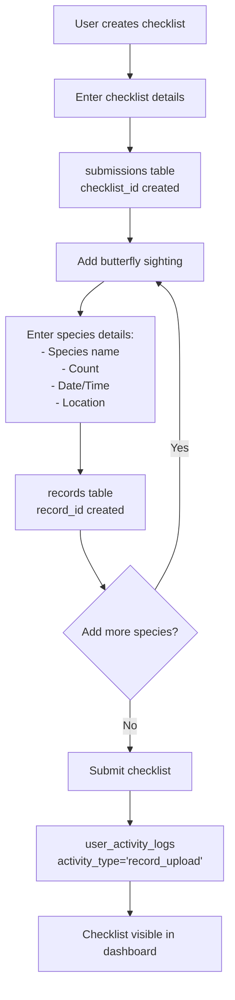

### 2.4 Expert Review Flow

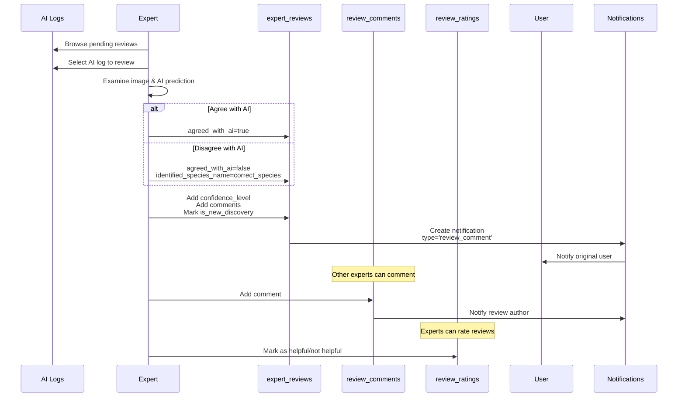

---

## 3. User Role-Based Workflows

### 3.1 Regular User Workflow

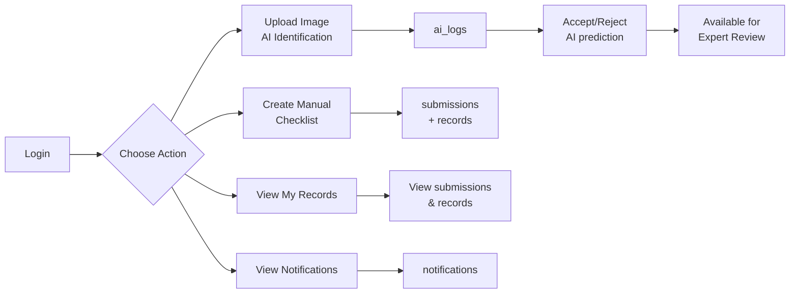

### 3.2 Expert User Workflow

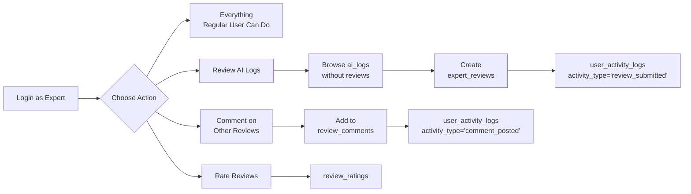

### 3.3 Admin Workflow

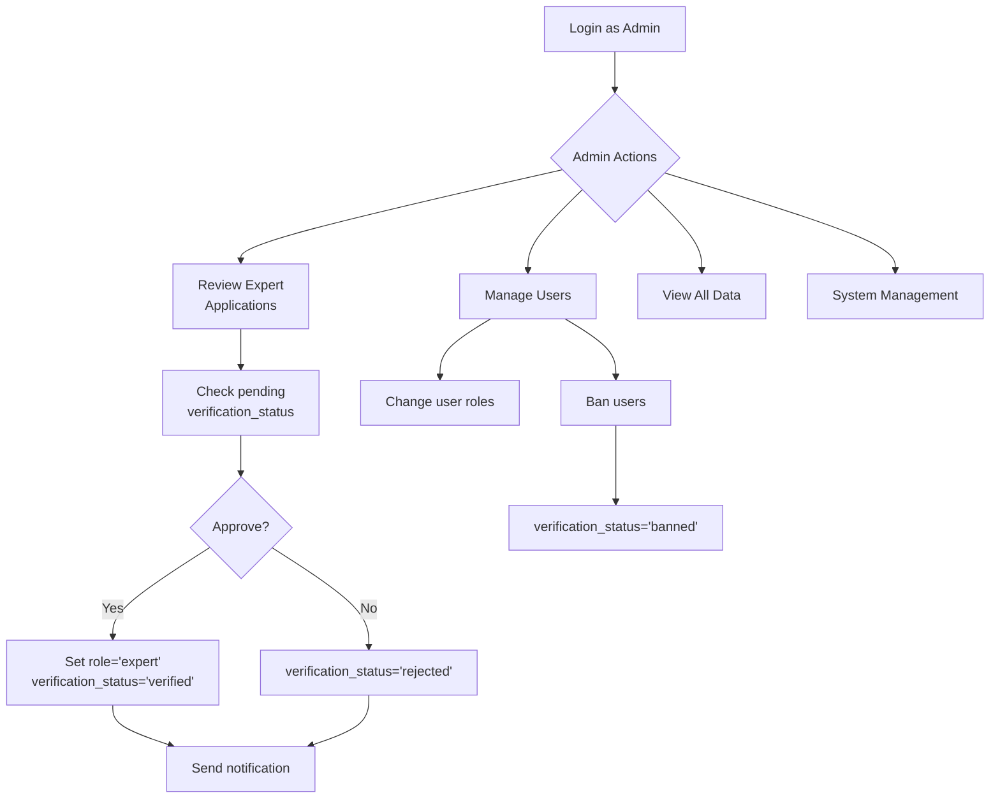

---

## 4. Data Relationships & Key Flows

### 4.1 Complete Identification Journey

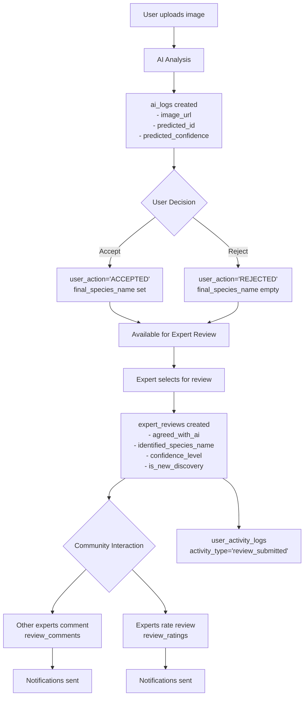

### 4.2 Notification Triggers

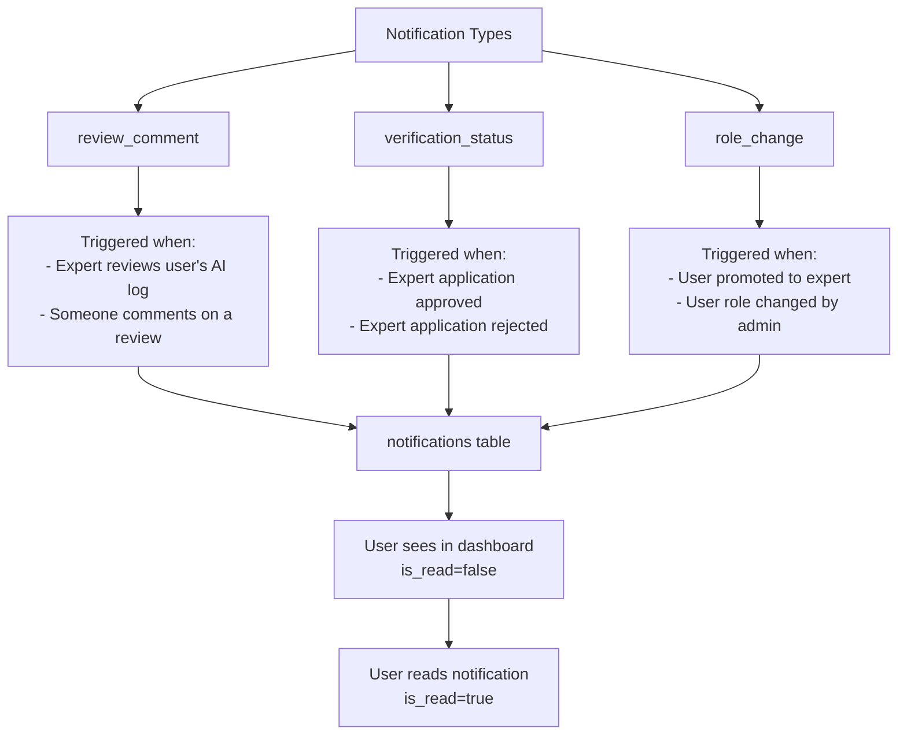

---

## 5. Data Access Patterns

### 5.1 Dashboard Queries

| User Role | Primary Queries |
|-----------|----------------|
| **User** | - My submissions (SUBMISSIONS + RECORDS) - My AI logs (AI_LOGS) - My notifications (NOTIFICATIONS) - Reviews on my submissions (EXPERT_REVIEWS) |
| **Expert** | - All of User queries - AI logs pending review (AI_LOGS without EXPERT_REVIEWS) - My expert reviews (EXPERT_REVIEWS) - Community comments (REVIEW_COMMENTS) - Review ratings (REVIEW_RATINGS) |
| **Admin** | - All users (USERS) - Pending expert applications (verification_status='pending') - All submissions statistics - System activity logs (USER_ACTIVITY_LOGS) |

### 5.2 Activity Tracking

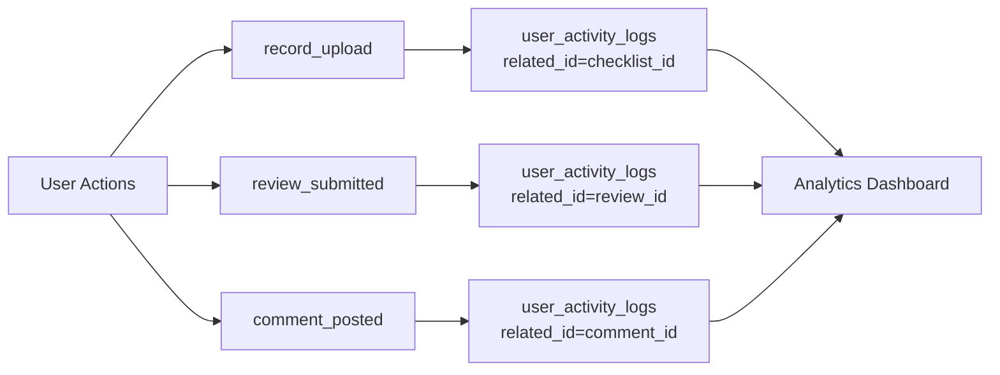

---

## 6. Data Integrity & Constraints

### 6.1 Role-Based Constraints

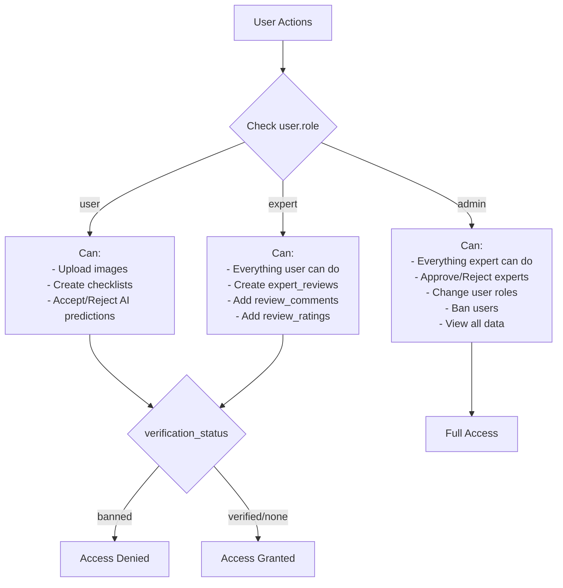

### 6.2 Data Validation Rules

| Table | Validation Rules |
|-------|-----------------|
| **users** | - role IN ('user', 'expert', 'admin') - verification_status IN ('none', 'pending', 'verified', 'rejected', 'banned') |
| **ai_logs** | - user_action IN ('ACCEPTED', 'REJECTED') - predicted_confidence: 0-1 range |
| **expert_reviews** | - confidence_level IN ('certain', 'uncertain') - reviewer_id must have role='expert' |
| **notifications** | - type IN ('review_comment', 'verification_status', 'role_change') |
| **user_activity_logs** | - activity_type IN ('record_upload', 'review_submitted', 'comment_posted') |

---

## 7. Complete System Flow

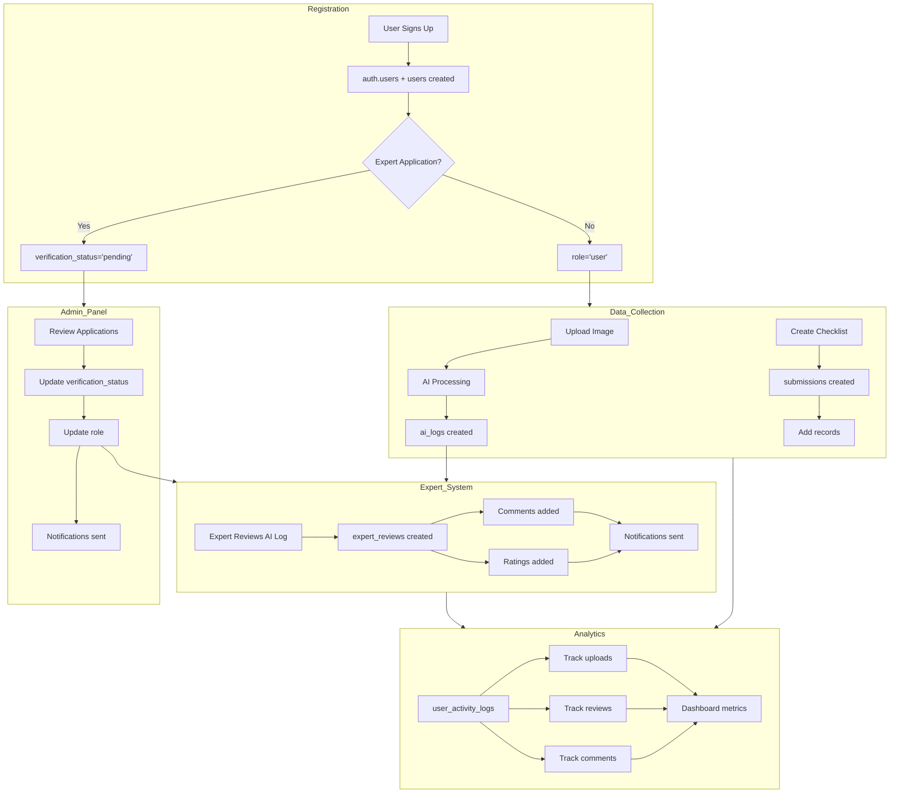

---

## 8. Key Insights

### Primary Data Flows:
1. **User → AI_LOGS → EXPERT_REVIEWS → Community Feedback**
   - Image upload creates AI log
   - Experts review and verify
   - Community discusses through comments and ratings

2. **User → SUBMISSIONS → RECORDS**
   - Manual data entry
   - Structured checklist-based recording
   - Geographic and temporal data capture

3. **User → Expert Application → Admin Approval → Expert Role**
   - Verification workflow
   - Role-based access control

### Data Dependencies:
- All user data depends on `auth.users` (Supabase authentication)
- Expert reviews depend on AI logs
- Comments and ratings depend on expert reviews
- Notifications are triggered by various events across the system
- Activity logs track all major user actions

### Access Patterns:
- **Users**: Create and view own data
- **Experts**: Review community data, provide feedback
- **Admins**: Manage users and oversee system

