# Human-in-the-Loop Verification Logic

## System Architecture Flowchart


## Database Schema Relationships


## Feedback Loop Decision Tree

```mermaid
flowchart LR
    subgraph "Expert Review Process"
        A[AI Prediction] --> B[Expert Examines]
        B --> C{Agrees with AI?}
    end
    
    subgraph "Outcome: AGREED"
        C --> |agreed_with_ai = TRUE| D[High Quality Match]
        D --> E[Golden Sample ⭐]
        E --> F[Added to Training Set]
        F --> G[Reinforces Correct Patterns]
    end
    
    subgraph "Outcome: DISAGREED"
        C --> |agreed_with_ai = FALSE| H[AI Made Error]
        H --> I[Flagged for Retraining 🚩]
        I --> J[Added to Correction Dataset]
        J --> K[Helps Fix Model Weaknesses]
    end
    
    subgraph "Continuous Improvement"
        G --> L[Model Retraining]
        K --> L
        L --> M[Smarter AI Model]
        M --> |Next Prediction| A
    end
    
    style D fill:#90EE90
    style E fill:#FFD700
    style H fill:#FFB6C1
    style I fill:#FF6B6B
    style M fill:#87CEEB
```



## Data Flow Sequence


## Key Benefits of This System

### 🎯 **Automated Quality Control**
- Every AI prediction is linked to expert validation
- No manual CSV manipulation required
- Database automatically tracks agreement/disagreement

### 📊 **Confidence Tracking**


### 🔄 **Continuous Learning Loop**
1. **AI Predicts** → Logged with confidence
2. **Expert Reviews** → Agreement tracked
3. **Feedback Collected** → Golden samples vs corrections
4. **Model Retrained** → Incorporates expert knowledge
5. **Performance Improves** → Cycle repeats

### 📈 **Measurable Improvement**
```sql
-- Track model improvement over time
SELECT 
    DATE_TRUNC('month', created_at) as month,
    AVG(CASE WHEN agreed_with_ai THEN 1 ELSE 0 END) * 100 as agreement_percentage
FROM expert_reviews
GROUP BY month
ORDER BY month;
```

## Implementation Status

✅ **Database Schema** - expert_reviews table exists  
✅ **Foreign Keys** - Links to ai_logs and reviewer_id  
✅ **Agreement Tracking** - Boolean field captures expert decision  
✅ **Confidence Levels** - Both AI and expert confidence stored  
🔄 **Training Pipeline** - Ready for integration  

---

**Note**: This system eliminates manual data management and creates a self-improving AI system where every expert review directly contributes to model enhancement.
